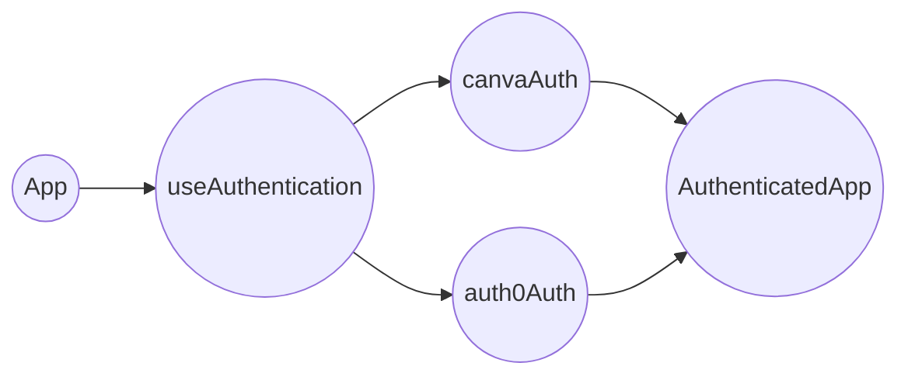
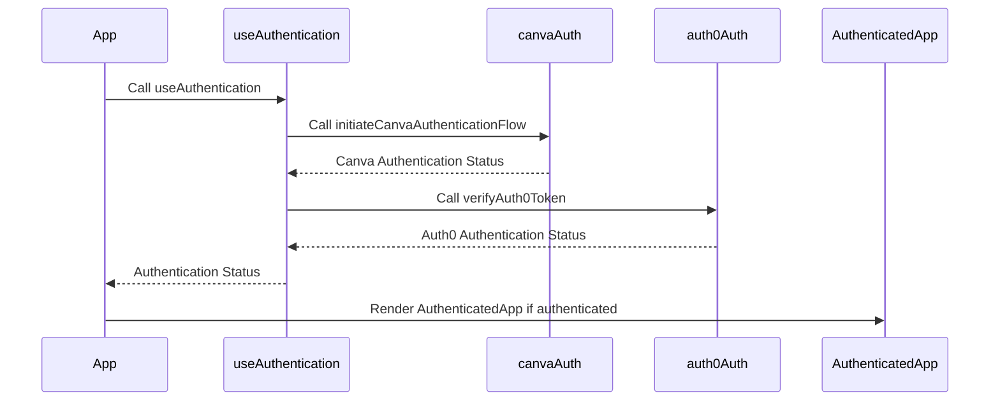
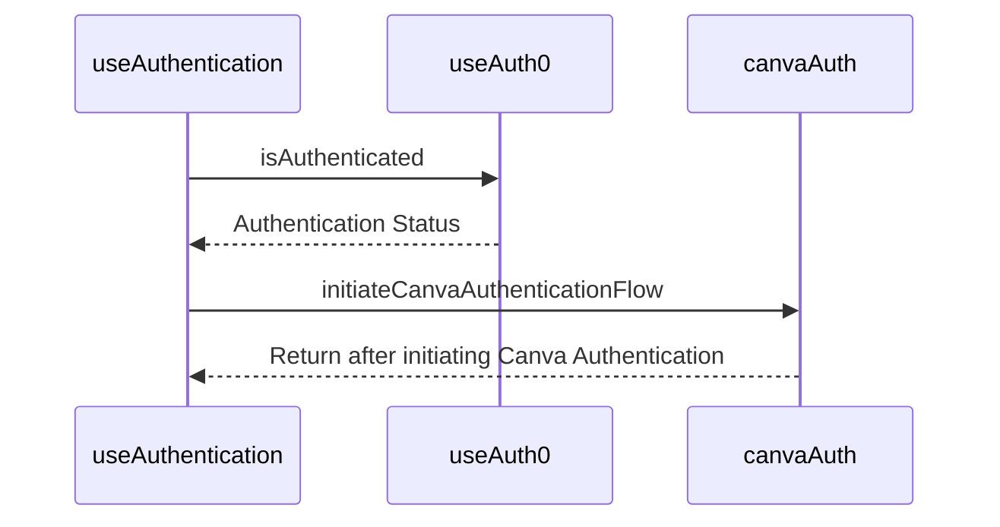
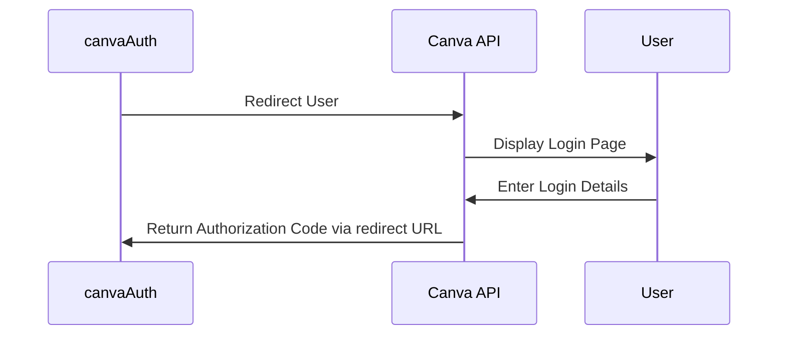
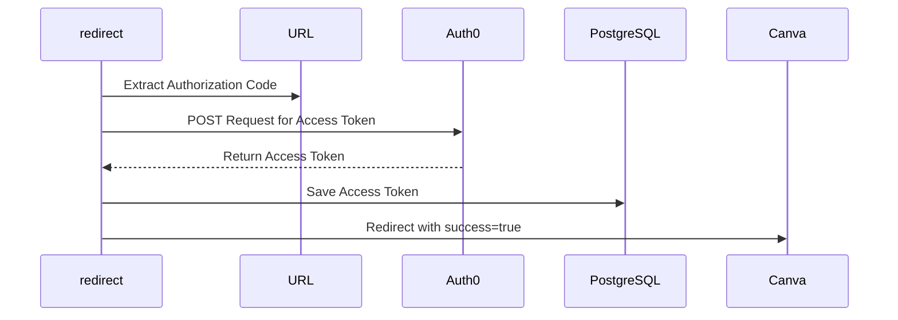
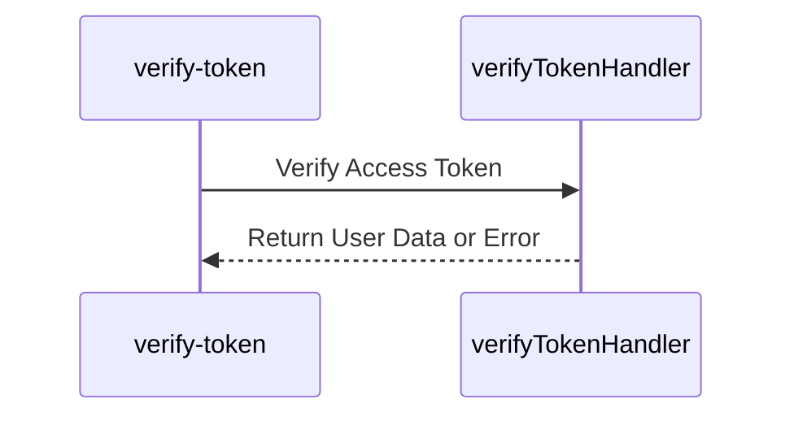
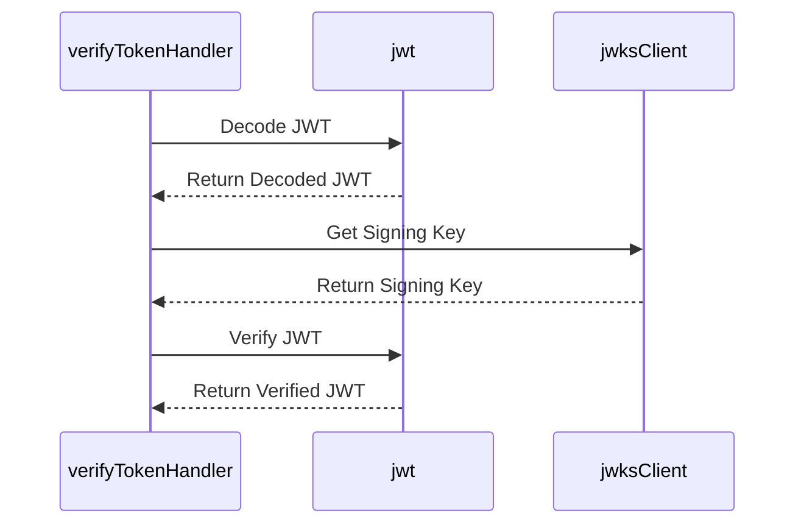

# Redesigned Authentication Flow in NFT App

In this revised design document, we delve into the redesigned authentication flow for our NFT App. This flow utilizes both Canva and Auth0 authentication services to provide a secure and reliable sign-in experience. Here's a step-by-step breakdown of the components and cloud functions involved in the system:

## High-Level System Design 

## Functional Flow Design 

## Components 

### 1. Index.tsx

This is the entry point of our React app. It wraps the main `App` component with `Auth0Provider` and `AppUiProvider`.

### 2. App.tsx

`App.tsx` is the central hub of the authentication flow. It uses the `useAuthentication` hook to check the user's authentication status and start the authentication process for unauthenticated users.

### 3. useAuthentication.ts

`useAuthentication.ts` manages the authentication state. It initiates the Canva authentication flow and verifies the Auth0 token.

This hook is responsible for managing the authentication state and orchestrating the authentication flow using Canva and Auth0.

### 4. canvaAuth.ts

This module initiates the Canva authentication flow using the Canva API.

### 5. auth0Auth.ts

`auth0Auth.ts` verifies the Auth0 token.

### 6. AuthenticatedApp.tsx

This component is rendered when the user is successfully authenticated.

## Cloud Functions 

### 1. redirect Cloud Function

This function is activated after the user logs into Canva and gets redirected back to our application.

> This function extracts the authorization code from the URL, and sends a POST request to Auth0 to exchange the authorization code for an access and refresh token. 

> Once the tokens are received, they are saved in a PostgreSQL database for future use. The function then redirects the user back to Canva with the original state and success=true.

### 2. verify-token Cloud Function

`verify-token` validates the Auth0 access tokens.

> This function uses the `verifyTokenHandler` module which checks the token, gets the user record from the database, and fetches user data from Auth0.

> If the token is expired, it calls `handleTokenExpiredError` which uses the refresh token to obtain a new access token from Auth0. The new access token is then saved to the database.

### 3. verifyTokenHandler

This module verifies Auth0 tokens. If the token has expired, the `handleTokenExpiredError` function is called to manage the token refreshing process.

> It first decodes the token using `jwt.decode()` to get the `kid` (Key ID). 

> Then, it uses `jwksClient.getSigningKey()` to retrieve the corresponding public key. Using this public key, it verifies the JWT using `jwt.verify()`. 

> If the token is expired, it calls `handleTokenExpiredError` function which manages the token refreshing process.

## Enhancements and Remarks

This newly designed authentication flow is expected to deliver a more secure and robust user experience. However, it's important to continually revisit and improve this design to cope with the rapidly evolving technological landscape. Specific areas that we should focus on include:

1. **Token Management**: Ensure secure storage and management of tokens.

2. **Scalability**: The authentication flow must cater to an increasing number of users.

3. **Error Handling**: Implement comprehensive error handling strategies to effectively manage potential errors or exceptions.

4. **User Experience**: Maintain a simple and intuitive authentication process to ensure a positive user experience.