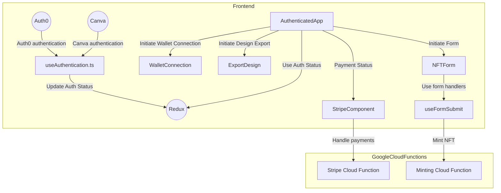

Given the information you provided and the codes, I will give a brief explanation of the components and their relationships, and then provide a design diagram with Mermaid.

Firstly, the general flow of the system can be described as follows:

1. User authentication is performed via Auth0 and Canva, with the "useAuthentication.ts" file orchestrating this process. The authentication status is stored in a Redux state.
2. After successful authentication, users can access the authenticated application. This is where the main user interaction happens. Users can connect their wallets, export designs from Figma, fill out a form, and mint an NFT.
3. The form is handled by the "useFormSubmit" and "NFTForm" components, which collect user data and prepare the data to be sent to the minting API.
4. The minting process is a Google Cloud Function that interacts with the NFTPort API.
5. Payment processing occurs via Stripe, which is also managed by a Google Cloud Function.

Now, let's represent this with a Mermaid diagram:

Please note that this is a simple illustration and doesn't include all aspects of the system (such as error handling, service interactions, etc.). Also, each box represents a process or component in the system, and the arrows show how data flows between these components. 

As for the detailed software design in markdown format, you could document each of these components, their roles, how they interact, the expected input and output, and more.

It's worth noting that software design is a comprehensive task that usually requires understanding the complete requirement, system constraints, and more. The actual design might be more complex than this and involve many more components and details. The diagram and explanation provided here are a simplified representation based on the information provided.