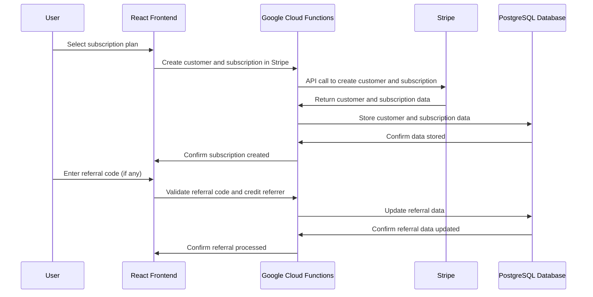

# Design Document for Stripe Integration

## Business Overview
Our platform provides subscription-based access to NFT minting services. Customers can choose from individual, team, and corporate plans, each with varying features and prices. We also have a referral program that rewards customers for referring new users. 

## Technical Overview
We're using a stack composed of a React frontend, Google Cloud Functions for the backend, a PostgreSQL database, and Stripe for payments and subscriptions.

## Stripe Side
Stripe will be used to manage all aspects of subscriptions, including product creation, payment collection, free trials, and changes or cancellations to subscriptions. Stripe will also handle the referral program using coupon codes.

## Implementation Details

### Stripe Implementation
1. **Subscription Products and Plans:** Set up three different products in Stripe for each plan (Individual, Team, and Corporate), each with its own pricing.

2. **Customer Creation:** Create a Stripe customer for each user who signs up to our platform. Stripe will manage their payment methods, subscriptions, and invoices.

3. **Payment Collection:** Use Stripe Checkout, a pre-built payment page, to handle secure payment collection.

4. **Trial Periods:** Set up trial periods directly in the subscription plans in Stripe. 

5. **Subscription Changes and Cancellations:** Use Stripe's webhooks to be notified of changes to a customer's subscription status.

6. **Referral Program:** Set up a coupon or promotion code system to reward referrals. Track referral codes and referrers in our own database.

### Code Side
1. **Stripe API Integration:** Use Google Cloud Functions to handle server-side operations like communicating with the Stripe API to manage customers, subscriptions, and payments.

2. **Webhook Handling:** Implement a webhook endpoint in Google Cloud Functions to receive updates about subscription statuses, payments, and other events from Stripe.

3. **Front-End Components:** Implement React components to handle user interactions with subscription management and the referral program.

4. **Referral Program Logic:** Implement the logic to generate, validate, and credit referral codes.

### Database Side
1. **Customer and Subscription Information:** Store basic customer and subscription information in a PostgreSQL database. This will serve as our own record and a way to manage application state.

2. **Referral Data:** Store referral data, such as who referred whom and the status of each referral.

3. **Subscription Plan Usage:** Track usage of each subscription plan, including the number of credits used and NFTs minted each month, per user.

### Design Side
1. **Subscription Management UI:** Design UI elements for subscription management, including plan selection, payment detail entry, and subscription status viewing.

2. **Referral Program UI:** Design UI elements for the referral program, including referral code entry, code display, and referral status viewing.

## Software Design Diagram

## Important Considerations
- Automated emails for different events such as end of trial period, changes in subscription status, successful referrals, etc. need to be set up.
- Handling of edge cases and errors like payment failures, exceeding plan limits, invalid referral codes, etc. is necessary.
- Secure handling and storage of customer data, particularly payment details, is essential. Stripe handles most of the security aspects but we need to ensure our database is secure too.
