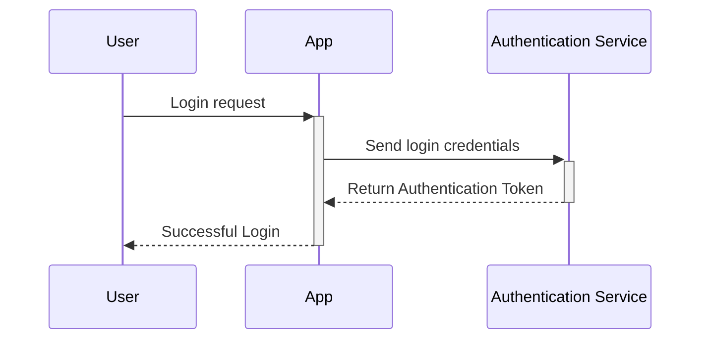
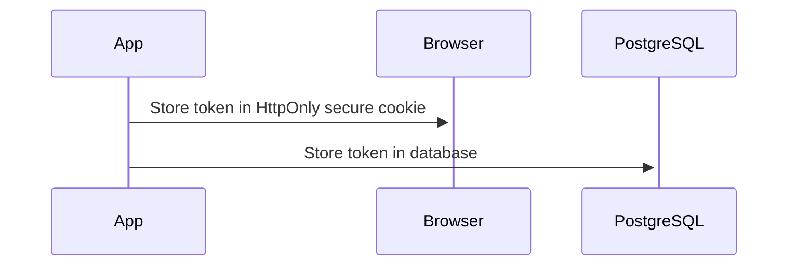
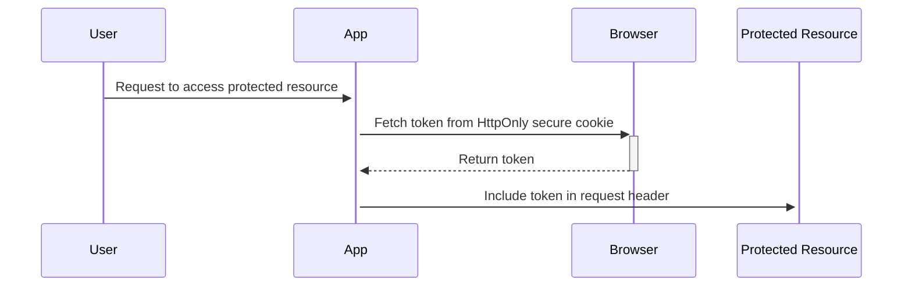
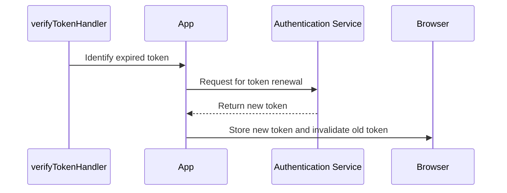
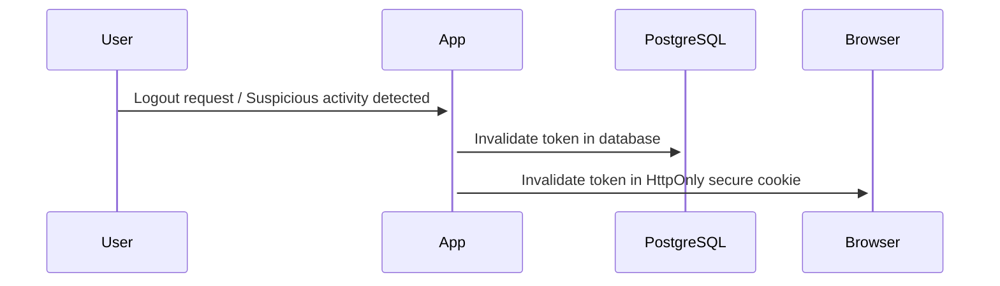
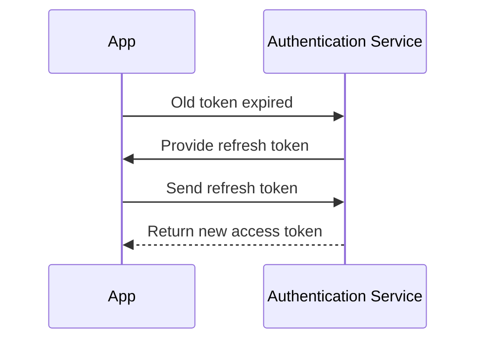

## Token Management

Managing authentication tokens is critical for maintaining security and providing a seamless user experience. Here's a step-by-step breakdown of the token management strategy we propose:

### 1. Token Generation

Authentication tokens are generated once the user successfully logs into the system. As demonstrated in the functional flow design, both the Canva and Auth0 authentications result in tokens that are crucial for maintaining an authenticated session.

### 2. Token Storage

Once the token is obtained, it's securely stored in the user's browser using HttpOnly secure cookies to prevent potential Cross-Site Scripting (XSS) attacks. This is managed in the `redirect` cloud function, which also stores a copy of the token in the PostgreSQL database for reference and verification purposes.

### 3. Token Usage

Each time the user makes a request to a protected resource or service within the app, the stored token is included in the request header. This token is then validated by the `verify-token` cloud function to ensure the user is authenticated.

### 4. Token Expiry and Renewal

Authentication tokens have a lifespan and expire after a certain period. When the `verifyTokenHandler` identifies an expired token, it triggers the `handleTokenExpiredError` function to initiate the token renewal process.

The renewal process involves generating a new token, storing it as outlined above, and invalidating the old token. The latter prevents any possible misuse of the expired token.

### 5. Token Revocation

In scenarios such as user logout or suspicious activity detection, it's crucial to have the capability to revoke tokens. This action invalidates the token immediately, denying access to any protected resources.

In summary, the token management strategy is a comprehensive approach to generate, store, use, renew, and revoke tokens, thereby ensuring a secure and smooth user experience.

Certainly! While the token management strategy outlined above covers many bases, there are still ways in which the system could be improved. Below, I will detail potential enhancements related to client-side token storage and management.

### Token Management Improvements

1. **Token Encryption**: Even though the tokens are stored in HttpOnly secure cookies, enhancing the security further by encrypting the tokens before storing them could be beneficial. This adds an additional layer of security, making it more difficult for malicious actors to use the token even if they manage to gain access to it.

2. **Refresh Tokens**: Currently, the system generates a new token every time the old one expires. An improvement to this could be the implementation of refresh tokens. Refresh tokens allow the application to obtain new access tokens without requiring the user to log in again, improving the user experience.

3. **Local Storage Fallback**: While HttpOnly cookies are more secure, there could be scenarios where this method might not work as expected (e.g., if a user's browser settings block cookies). In such cases, as a fallback, tokens can be stored in local storage. However, it is crucial to ensure that the risks associated with this method, like susceptibility to Cross-Site Scripting (XSS) attacks, are mitigated by adopting protective measures.

4. **Token Blacklisting**: In case of suspicious activity or logout, besides invalidating the token in the database and the user's browser, it would also be beneficial to maintain a server-side blacklist of revoked tokens. This ensures that even if a malicious actor intercepts the token, they cannot use it as the system would recognize it as a blacklisted token and reject it.

5. **Session Management**: Enhancing the system to include active session management can significantly improve security. With this, users can view all the active sessions, i.e., where their account is currently logged in. They can choose to log out of individual sessions, improving security by providing an easy way to end sessions on devices they no longer have access to or don't recognize.

Incorporating these improvements can provide a more robust and secure token management strategy while also improving the user experience.
